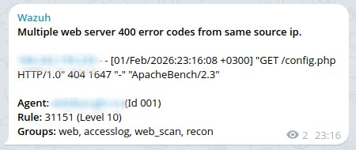

Wazuh alerts in Telegram
==



If you want to receive Wazuh alerts into the telegram channel then:

1. Place the **custom-telegram** binary into then **/var/ossec/integrations** folder on Wazuh manager host
2. Add the followed block into the Wazuh manager configuration (**/var/ossec/etc/ossec.conf**)
```
   <integration>
     <name>custom-telegram</name>
     <level>9</level>
     <api_key>YOUR_TELEGRAM_CHANNEL_ID</api_key>
     <hook_url>https://api.telegram.org/botYOUR_TELEGRAM_BOT_TOKEN/sendMessage</hook_url>
     <alert_format>json</alert_format>
   </integration>
```
3. And restart the Wazuh manager
